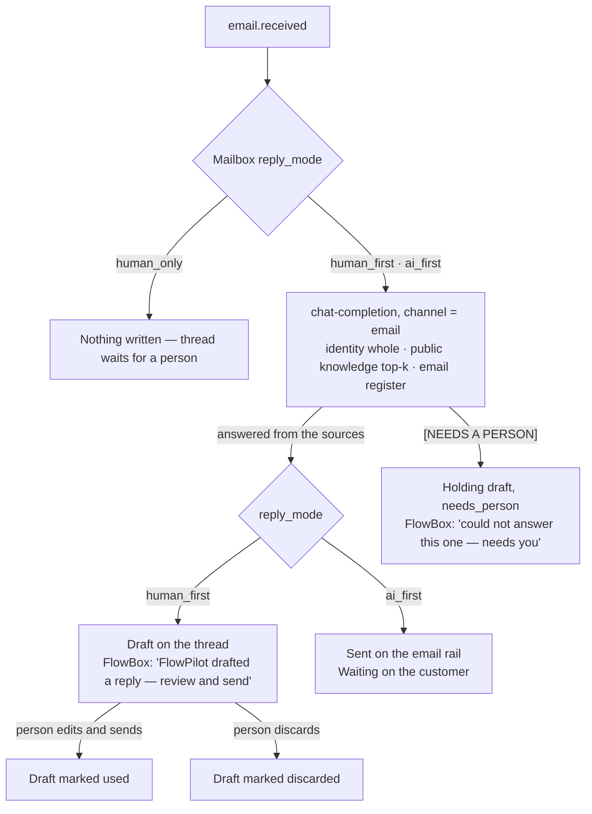

# Email — inbox, replies and FlowPilot first

> Companion to the generated [Email module page](./email.md). Hand-maintained. Transport (Composio / Gmail OAuth, webhooks, the polling fallback) is in [Composio Gmail sync](../guides/composio-gmail-sync.md); the queue that mail shares with every other channel is [FlowBox](./flowbox.md).

Email is the company mailbox *and* the email rail. One shared mailbox is connected (Gmail through Composio); replies come back to it, bind to the customer they concern, and are answered from FlowWink — by FlowPilot first, then a person. Every send from every module goes through the same `email-send` gateway.

---

## On the Modules page

The module is listed as **Email** (core, always on, `category: system`). It has had an admin surface since the inbox shipped, so both **Email** and **FlowBox** appear in the **Support** menu group. It used to be listed as "Email Router" with the admin UI hidden — that flag lives in the module definition and is read from code, so the change reached every instance without a migration. Role access follows the `email` module in **Role Permissions**.

---

## The Email page (`/admin/email`)

| Tab | What it holds |
|---|---|
| **Inbox** (default) | Threads and replies — shaped like a mail client, below. |
| **Templates** | Reusable subject + HTML with `{{variable}}` substitution, one template per kind per language; preview with sample values; used by `email-send` via `template_name`. |
| **Signatures** | HTML signatures, per from-address or personal default; appended automatically on matching sends. |
| **Suppressions** | Hard bounces and complaints auto-suppress; manual entries; recent ESP delivery events. |
| **Sending** | The HOW layer: **Default outbound provider** (*Auto — Resend, then SMTP, then Composio* · *Resend* · *SMTP* · *Composio / Gmail*), **Default From identity**, **Newsletter tracking**, and the **Inbound mailboxes** registry with each mailbox's two dials. |

### Inbox: shaped like a mail client

- **Left**: a dense list — who · subject – newest line · time, a message count, and a FlowPilot icon when a draft is waiting. **Search mail** filters on who, subject and snippet.
- **Right**: the conversation. Older messages fold to one line; the newest is open. A FlowPilot draft is highlighted and says *Waiting in the reply box below — edit, send or discard.* The record the thread binds to (lead, ticket, company) is a badge that links there.
- **Bottom**: the reply box.
- Links in mail bodies show the address without scheme, `www`, query or fragment (folded in the middle when long); the full URL is the link target.

`?tab=threads&thread=<key>` opens a thread directly — FlowBox rows link here.

### Replying

One textarea, **Send reply** (⌘⏎), plain text. The reply goes through `email-send` with `expects_reply`, which prefers the connected Gmail (Composio) — the rail that threads: `In-Reply-To`, `References` and the provider thread id — so the answer lands in the customer's own conversation and comes back to the same thread when they answer again. The reply binds to the same CRM record the inbound message resolved to and is logged on the thread and in **FlowBox → Message log**.

The same box is used inside FlowBox (**Reply here** on an email row).

---

## FlowPilot goes first on email

Every inbound message emits `email.received`. Two platform automations listen:

| Automation | Skill | What it does |
|---|---|---|
| `flowpilot_drafts_email_reply` | `draft_email_reply` | Writes a reply with the same responder as the website chat; the mailbox's **reply mode** decides what happens to it. |
| `inbound_email_to_ticket` | `email_to_ticket` | Opens a ticket, or appends to one, when the mailbox's **route mode** and the noise gate say so. |

### The two dials on a mailbox

Set on the mailbox card under **Email → Sending** or **FlowBox → Routing** (same rows, same writer).

**Route replies to** (`route_mode`) — *where* the mail lands:

| Option | Behaviour |
|---|---|
| **CRM only — attach to contact/lead** (default) | Bind to the matching contact / lead / company. Never a ticket. |
| **CRM, else ticket** | Bind to the CRM record when one matches; otherwise open a ticket. |
| **Ticket only** | Always open a ticket. Needs the Tickets module. |

**Who answers** (`reply_mode`) — *who* replies first, the same dial shape as the chat's routing mode:

| Option | Behaviour |
|---|---|
| **FlowPilot drafts — a person sends** (`human_first`, default) | The reply is filed as a **draft** on the thread. Nothing is sent. A person edits, sends or discards it from FlowBox or the Inbox. |
| **FlowPilot answers — drafts when unsure** (`ai_first`) | The reply is **sent** on the email rail when the responder answered from the sources. When it could not (`[NEEDS A PERSON]`), a holding draft is filed with `needs_person` and the row waits for someone. If the rail refuses the send (no provider, allowlist), the answer is kept as a draft with the error recorded. |
| **Person only — FlowPilot writes nothing** (`human_only`) | The thread waits for a person. |

The chat's routing mode does not gate email; the mailbox has its own dial. A mailbox the event cannot identify answers as `human_first`.

### Drafts in the ledger

A draft is one `outbound_communications` row: `status = draft`, `provider = flowpilot`, `metadata.draft_of = <inbound message id>`, `needs_person` when the responder asked for one. It shows on the thread, pre-fills the reply box, and is marked **used** when the person sends or **discarded** when they drop it — so the Message log carries the whole story (**Draft** → **Draft used** / **Draft discarded**). Spent drafts are never counted as a turn and never sent as history to the responder.

`draft_email_reply` skips, and says why: `classification = noise` (newsletters, bulk, no-reply senders), mail from the mailbox itself, an empty body, `human_only`, or a message it has already answered (idempotent on the message id). Its steps show on the FlowBox row like any other FlowPilot step.

---

## One responder for every channel

`chat-completion` is FlowPilot's grounded responder: Business Identity read whole, published knowledge retrieved top-k, and the chat's hand-off tools. Every visitor-facing channel answers through it, so the same question gets the same answer whichever door it came through (Law 3 — no second pipeline).

| Channel | Path in | Register |
|---|---|---|
| Web chat widget / chat block / `/chat` | the widget → `chat-completion` | chat |
| Telegram | `telegram-ingest` → `chat-completion` | chat |
| SMS (46elks) | `elks46-ingest` → `chat-completion` | chat |
| Email | `draft_email_reply` → `chat-completion` with `channel: 'email'` | email |

The **email register** is the only thing that differs: greet the sender by first name when the message shows one, full sentences, a sign-off in the company's name, and — instead of the chat's `handoff_to_human` tool, which needs a chat conversation — the marker **`[NEEDS A PERSON]`** on the first line when the sources do not cover the question, followed by a short holding reply. The mail rail reads the marker and never sends on its own, whatever the mailbox's reply mode.

WhatsApp and Slack are **not** channels — nothing ingests them.

---

## Skills

| Skill | Use |
|---|---|
| `draft_email_reply` | Answer an inbound mail under the mailbox's reply mode; replay a missed `email.received`. `reply_mode` and `force` override the dial and the noise gate for a manual replay. |
| `email_to_ticket` | Turn an inbound mail into a ticket (or a comment on one), respecting route mode and the noise gate. |
| `reply_to_ticket_via_email` | Reply on an email-sourced ticket, threaded, from the connected mailbox. |
| `send_email` | One-off send through the gateway (requires approval). |
| `ingest_inbound_email` | Backfill / repair: read the mailbox and file messages against their customer. |
| `list_communications`, `get_communication` | Read the ledger. |
| `manage_email_template` | Templates, one per kind per language. |

---

## Files

| Purpose | Path |
|---|---|
| Page | `src/pages/admin/EmailPage.tsx` |
| Reply box | `src/components/admin/email/ThreadReply.tsx` |
| Sending tab | `src/components/admin/EmailRouterSettings.tsx`, `src/components/admin/email/InboundMailboxesSection.tsx` |
| Module, skills, automations | `src/lib/modules/email-module.ts` |
| FlowPilot's reply | `supabase/functions/_shared/handlers/draft-email-reply.ts`, `supabase/functions/_shared/email/responder-client.ts` |
| The email register | `supabase/functions/chat-completion/index.ts` (`buildEmailRegister`, `channel`) |
| `reply_mode` column | `supabase/migrations/20260906100000_brevladan-far-en-svarare.sql` |
| Tests | `src/lib/__tests__/email-responder.test.ts`, `src/lib/__tests__/inbox-items.test.ts`, `src/lib/__tests__/email-body.test.ts` |

---

## See also

- [FlowBox — one queue over every channel](./flowbox.md)
- [Composio Gmail sync](../guides/composio-gmail-sync.md) — connecting the mailbox, latency, troubleshooting
- [Email routing: transports, mailboxes, and what a conversation binds to](../architecture/email-routing-and-mailboxes.md) — the design decisions
- [Conversation and retrieval](../architecture/conversation-and-retrieval.md) — the responder's grounding
