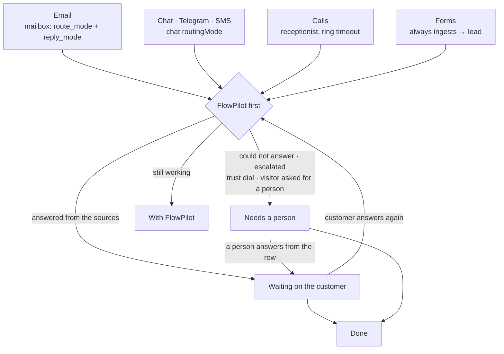

# FlowBox — one queue over every channel

> Companion to the generated [Contact Center](./live-support.md) and [Email](./email.md) pages. Hand-maintained. FlowBox replaced the Live Support, Inbox, Routing and Communications pages on 2026-09-02; the old addresses redirect (see [Old addresses](#old-addresses)).

FlowBox (`/admin/flowbox`, menu **Support → FlowBox**) is where the desk works. It is not a sixth table: every row is a read of a row that already exists — an email thread, a chat conversation, a ticket, a form submission, a voice call — and every action writes back to the surface that owns it.

The organising question is not *which channel* but **who has it**. FlowPilot goes first; what it could not finish, was not allowed to finish (the trust dial), or a visitor explicitly asked a person for, is the hand-off list at the top.

---

## Tabs

| Tab | What it holds |
|---|---|
| **Queue** | Every conversation on every channel, grouped by state. Channel chips (**All**, **Email**, **Chat**, **Tickets**, **Forms**, **Calls**) with open counts; a **Show done** switch. |
| **Calls** | Callbacks to book or complete, and voicemail to play — the two panels that used to be Live Support tabs. Same panels, moved. |
| **Routing** | The rules: where each channel lands, who takes it first, when a person steps in. Lenses over each channel's own settings — see [Routing](#routing). |
| **Message log** | The ledger: everything sent and received (`outbound_communications`), with the record it binds to, a routing-quality figure ("N of M messages are bound to a customer") and a **Link** action for unbound mail. FlowPilot's email drafts appear here as **Draft**, **Draft used**, **Draft discarded**. |

The presence toggle in the header applies to all four tabs.

---

## The four states

| State | Label in the UI | Meaning |
|---|---|---|
| `human` | **Needs a person** | Escalated by FlowPilot, asked for by a visitor, not allowed to finish, a new form, a callback due, mail awaiting an answer. Your hand-off list. |
| `agent` | **With FlowPilot** | The operator is on it. Nothing hidden — open the row to read every step it took. |
| `customer` | **Waiting on the customer** | Answered; the ball is with them. |
| `done` | **Done** | Closed, resolved or handled in the last 30 days. Hidden unless **Show done** is on. |

Each row carries who, subject, a plain-language reason ("visitor asked for a person", "FlowPilot drafted a reply — review and send"), a priority badge when it is not `normal`, the CRM record the item binds to (a **lead** / **company** badge that links there), and the time since the last activity.

How each channel maps into the states (`src/lib/inbox-items.ts`):

| Channel | Source | Needs a person | With FlowPilot | Waiting on the customer | Done |
|---|---|---|---|---|---|
| Email | `email_threads` + the thread's messages | last message is inbound (a FlowPilot draft is a proposal, never a turn) | — | last message is ours | thread has no messages |
| Chat | `chat_conversations` — web widget, Telegram, SMS | `waiting_agent`, `escalated`, `with_agent` | `active` (FlowPilot is answering) | — | `closed` / `resolved` |
| Tickets | `tickets` | open or new | — | `waiting` | `resolved` / `closed` |
| Forms | `form_submissions` | not handled and no lead yet | — | — | `handled_at` set, **or** FlowPilot created the lead (the follow-up lives on the lead) |
| Calls | `voice_calls` | callback pending / scheduled, voicemail, missed call | `ai_handled` (FlowPilot took the call) | — | everything else |

The five sources are read separately (last 30 days, row-capped) and merged in the client. A source the role may not read comes back empty through RLS; a source that is not installed is logged and skipped. The queue is never blank because one channel is missing.

The same fact has different lenses. An email thread bound to a lead reads as "a reply on my lead" to the seller and as "awaiting an answer" to the desk — one row, one binding, two readings.

---

## FlowPilot's steps on a row

A row that FlowPilot has touched carries a chip — **FlowPilot · 3 steps · last: qualify lead**. Expanded, it lists the last five steps in order: skill, status (✓ success, ◐ pending approval, ✗ failed), time, the agent when it was not FlowPilot, and one short line out of the output (a message, summary or reason — never the whole payload).

The steps come from `agent_activity`, matched against the row's own ids (conversation id, ticket / lead / call id, thread key) — the same ledger objectives are closed on. "With FlowPilot" is therefore a reading, not a claim.

---

## Presence: "go live" is a toggle, not a room

The header shows **You are reading** or **You are live**, with a switch labelled *Go live* and a count of colleagues live now.

| | Reading (off) | Live (on) |
|---|---|---|
| The queue | fills, readable, every FlowPilot step visible | the same |
| Email, tickets, forms | answerable | answerable |
| New chat hand-offs and incoming calls | do not ring you | can reach you |

Answering an email or a ticket never needs live — sales answers mail logged in without going live. The toggle writes `support_agents.status` (`online` / `offline`); the `support_agent_offline_release` trigger hands your open chats back to the queue when you go offline.

---

## Answering from the row

Every channel except calls is handled inline: a **Reply here** (email, chat, tickets) or **Handle here** (forms) link under the row opens the box; **Close** folds it.

| Channel | What the box does |
|---|---|
| **Email** | The same reply box as **Email → Inbox**: plain text, **Send reply** (⌘⏎), sent through `email-send` with In-Reply-To / References / the provider thread id, bound to the same CRM record as the inbound mail, logged on the thread. When FlowPilot has drafted a reply the link reads **Review FlowPilot's draft** and the box opens pre-filled — edit freely, **Send reply** marks the draft *used*, **Discard draft** marks it *discarded*. |
| **Chat** | Shows the last six messages (visitor / you-or-colleague / FlowPilot). Sending claims the conversation for you (`with_agent`) if nobody has it. **Transfer to…** hands it to a colleague (the same reassign path as the `support_assign_conversation` skill); **Close** closes it. When you are not live the reply still goes out, but new hand-offs will not ring you. |
| **Tickets** | Adds a comment the ticket already knows: public, or an **Internal note** the customer never sees. With a contact address, **Also email <address>** sends the reply on the email rail bound to the ticket, so it shows in the ticket's trail and in the Message log. Customers see public comments in their portal. |
| **Forms** | Shows the submitted fields. **Mark handled** stamps `handled_at` / `handled_by` (the same stamp the Forms page uses). When the submission carries an address, **Send reply** emails the sender on the rail, bound to the submission — sending *is* handling, so it stamps too. |
| **Calls** | No inline box; the **Calls** tab has callbacks and voicemail. |

---

## Routing

Routing is the same three questions for every inbound channel: where does it land, who takes it first, when does a person step in.

The **Routing** tab owns no setting. Each card is a lens over the channel's own configuration, and each control writes exactly where that channel's own page writes — one fact, one writer, several readers.

| Card | Controls | Writes to | Also editable at |
|---|---|---|---|
| **Email** | Per mailbox: **Route replies to** (*CRM only — attach to contact/lead* · *CRM, else ticket* · *Ticket only*) and **Who answers** (*FlowPilot drafts — a person sends* · *FlowPilot answers — drafts when unsure* · *Person only — FlowPilot writes nothing*). Ticket options need the Tickets module. | `inbound_email_accounts.route_mode` / `reply_mode` | **Email → Sending** |
| **Chat, Telegram, SMS** | **Who takes it first**: *FlowPilot first — answers, escalates on demand* · *Person first — straight to whoever is live, FlowPilot if nobody is* · *FlowPilot only — never escalates* · *Person only — never FlowPilot, queues when nobody is live* | `site_settings.chat.routingMode` | **AI Chat → Advanced** |
| **Calls** | **FlowPilot receptionist** (answers when nobody is live or the ring times out), **Ring people for** (seconds), **Book callbacks automatically** | voice settings | **Voice** |
| **Forms** | No policy — the form block always ingests; a submission with an email becomes a lead on the spot | — | **Forms** (per-form notification address) |

What these policies leave for a person shows up in the Queue as **Needs a person**. Routing decides who goes first, never who gets to see.

Email's two dials and the responder behind them are described in [Email — inbox, replies and FlowPilot first](./email-guide.md).

---

## Channels: what is one and what is not

| Transport | Arrives as | In FlowBox |
|---|---|---|
| Email (the company mailbox via Composio / Gmail) | `email_threads` + `outbound_communications` | **Email** rows; replies threaded on the same rail |
| Web chat widget | `chat_conversations`, `channel='web'` | **Chat** rows |
| Telegram (`telegram-ingest`) | `chat_conversations`, `channel='telegram'` | **Chat** rows |
| SMS (46elks adapter, `elks46-ingest`) | `chat_conversations`, `channel='sms'` | **Chat** rows — there is no separate SMS filter |
| Voice (46elks / Twilio) | `voice_calls` (+ a `channel='voice'` conversation for the log) | **Calls** rows and the Calls tab |
| Forms (form block) | `form_submissions` | **Forms** rows |
| Tickets (created by hand, by `email_to_ticket`, or by an agent) | `tickets` | **Tickets** rows |
| WhatsApp, Slack | — | **Not channels.** Nothing ingests them. |

Web chat, Telegram, SMS and email all answer through the same responder (`chat-completion`); see [One responder for every channel](./email-guide.md#one-responder-for-every-channel).

---

## What the `liveSupport` module still owns

The **Contact Center** module (`liveSupport`) lost its page, not its job. It still owns the `support_agents` table and presence, the conversation lifecycle (`waiting_agent → with_agent → closed`, reopen), the claim / release trigger, and the skills FlowPilot and external agents use on chats: `support_list_conversations`, `list_support_agents`, `support_assign_conversation`, `route_conversation`, `send_channel_message`, `manage_channel`, `request_callback`, `handle_voicemail`, `support_get_feedback`. The architectural rule is unchanged: FlowBox is a view over channel-owning modules, never a channel owner — see [FlowBox as aggregator](../architecture/flowbox-as-aggregator.md).

---

## Old addresses

| Old | Now |
|---|---|
| `/admin/live-support` | `/admin/flowbox` |
| `/admin/live-support?conversation=<id>` | `/admin/flowbox?open=chat:<id>` — that row's reply is already open |
| `/admin/live-support?tab=callbacks` or `?tab=voicemail` | `/admin/flowbox?tab=calls` |
| `/admin/inbox` | `/admin/flowbox` |
| `/admin/routing` | `/admin/flowbox?tab=routing` |
| `/admin/communications` | `/admin/flowbox?tab=log` |

Old provenance lines, bookmarks and dashboard links land right. The Dashboard's "Waiting for support" and the SLA Monitor's chat links point at FlowBox.

---

## Where it lives in the menu

The **Support** group is: **FlowBox**, **Email**, **Tickets**, **Surveys & NPS**, **AI Chat**, **Voice**. FlowBox and Email follow the `email` module (core, always on, role-gated in **Role Permissions**); the others follow their own module. Surveys & NPS moved here from Sales on 2026-09-03 (it measures service, not selling); Field Service sits under **Operations** next to Maintenance and SLA Monitor.

---

## Files

| Purpose | Path |
|---|---|
| Page | `src/pages/admin/FlowBoxPage.tsx` |
| Queue rows, states, step matching | `src/lib/inbox-items.ts`, `src/hooks/useInboxItems.ts` |
| Inline replies | `src/components/admin/flowbox/EmailReply.tsx`, `ChatReply.tsx`, `TicketReply.tsx`, `FormHandle.tsx` |
| Routing lenses | `src/components/admin/flowbox/RoutingLenses.tsx` |
| Message log | `src/components/admin/flowbox/MessageLogTab.tsx` |
| Calls tab panels | `src/components/admin/live-support/CallbacksPanel.tsx`, `VoicemailPanel.tsx` |
| Presence | `src/hooks/useSupportPresence.tsx` |
| Redirect from the retired page | `src/pages/admin/LiveSupportRedirect.tsx` |
| Tests | `src/lib/__tests__/inbox-items.test.ts` |

---

## See also

- [Email — inbox, replies and FlowPilot first](./email-guide.md) — the Email page, reply modes, the shared responder
- [FlowBox as aggregator](../architecture/flowbox-as-aggregator.md) — why FlowBox owns no channel
- [Channels vs Modules](../architecture/channels-vs-modules.md)
- [Channel Adapter Contract](../architecture/channel-adapter-contract.md)
- [Composio Gmail sync](../guides/composio-gmail-sync.md) — connecting the company mailbox
- [Support-to-Resolution](../processes/support-to-resolution.md) — the end-to-end process
- [Voice / WebRTC Softphone](./voice-softphone.md)
