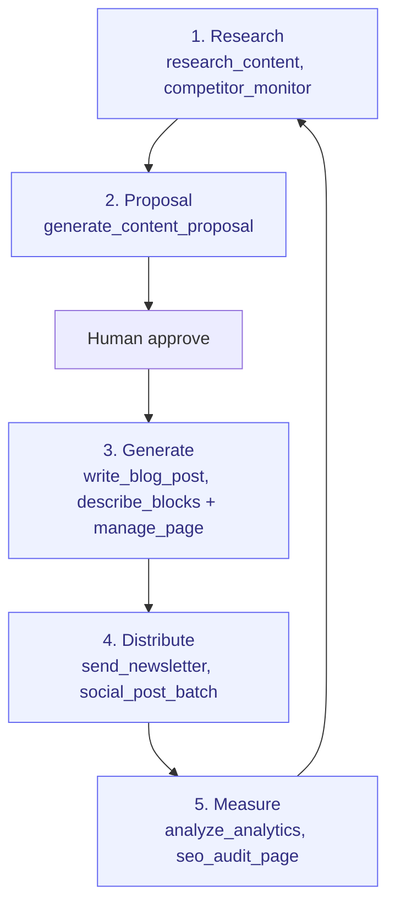

# Content-to-Conversion

> From idea to published article to measurable outcome. FlowWink's "agent-shines" process.

**Problem it solves:** Content marketing dies of "no time to write" — research, drafting, distribution and measurement each need hours nobody has — this process lets the agent run the whole pipeline while a human only approves the ideas.

**Maturity level:** L4 — Agent-augmented
**Status:** ✅ FlowPilot's strongest autonomous flow

---

## Modules involved

| Module | Role in the process |
|--------|---------------------|
| **Pages** | Landing pages (block-based) |
| **Blog** | Articles, categories, tags |
| **Knowledge Base** | Self-service support articles |
| **Newsletter** | Distribution to subscribers |
| **Paid Growth** | Ad campaigns to amplify reach |
| **Analytics** | Tracking traffic, conversion, SEO |
| **Visitor Intelligence** | Consent-based visitor journey (cookie + page views); hands the browsing history to [Lead-to-Customer](./lead-to-customer.md) as scoring signals the moment a visitor identifies |
| **Sales Intelligence** | Competitor and topic research |
| **Retrieval Engine** (`knowledge_chunks`) | Indexes published blog posts, pages, KB articles, wiki and docs for hybrid search so chat surfaces (docs-chat, workspace-chat, public chat) ground answers in real content instead of a bulk dump |

---

## Step-by-step flow (Content Pipeline — 5 steps)

*🟦 = agent-runnable step (see Agent coverage below)*

---

## Agent coverage

| Step | 👤 Manual | 🤖 FlowPilot | 🔗 External agent |
|------|----------|-------------|-------------------|
| Competitor research | ✅ | ✅ (`competitor_monitor`, `research_content`) | 🔗 Delegation possible |
| Content brief | ✅ | ✅ (`seo_content_brief`) | — |
| Proposal generation | — | ✅ (`generate_content_proposal`) | 🔗 Audit via peer |
| Article writing | ✅ | ✅ (`write_blog_post`) | 🔗 Review via peer |
| Landing page composition | ✅ | ✅ (`describe_blocks` → `manage_page` / `manage_page_blocks`) | 🔗 Same skills via MCP |
| Social posts | ✅ | ✅ (`social_post_batch`, `generate_social_post`) | — |
| Newsletter sends | ✅ | ✅ (`send_newsletter`) | — |
| Ad creative | ✅ | ✅ (`ad_creative_generate`) | — |
| Performance analysis | ✅ | ✅ (`analyze_analytics`, `ad_performance_check`) | — |
| KB gap analysis | — | ✅ (`kb_gap_analysis`) | — |

---

## Known gaps (missing for L5)

- ✅ A/B testing of headlines/CTAs — `manage_page_experiment` (two-version page split test)
- ✅ Multi-language content management — `manage_page_translation` (multi-language pages)
- ✅ UTM / attribution tracking — `get_attribution_report` (campaign/source/medium over a window, leads + orders)
- ✅ **Conversion goals and per-page conversion (2026-09-20)** — `manage_conversion_goal` says what counts
  (a lead, a booking, a paid order, an accepted quote, a subscription, or a page being reached, with what
  one is worth when the record carries no amount); `conversion_report` gives completions, the rate per
  unique visitor, the value and the campaign and landing page behind each; `page_conversion_report`
  answers **which page gave the lead** — its leads, their customers and their revenue. `analytics_dashboard`
  hands an agent the same figures /admin/analytics shows. Two rules the reports keep: an assumed value is
  labelled assumed and never presented as revenue, and with no page views the rate is **absent, not zero** —
  the tracker runs in the visitor's browser, so an untracked site is unmeasured, not failing.
  Found on the way: a lead born in the chat never got its utm fields even though the visitor's own page
  views carried them, so the campaign report counted it as `(none)`. `stitch_visitor_to_lead` now stamps
  first and last touch from those views — without overwriting what the form already captured.
- ✅ Blog comments + moderation (`moderate_blog_comment`, `list_blog_comments`), RSS (`get_blog_rss_url`), SEO meta (`generate_meta_description`, `generate_alt_text`), author pages
- ✅ Media library / DAM — alt-text (`media_set_alt_text`), where-used (`media_find_usage`), optimized variants (`media_optimize`), browse (`media_browse`)
- ✅ Organic social scheduling — `schedule_social_post`, `list_social_posts`, `mark_social_post_posted`; campaign optimization `ad_optimize`
- ✅ Cross-content retrieval — published blog/pages/KB/wiki/docs are chunked and hybrid-ranked (`knowledge_chunks`, indexed by the `knowledge-indexer` cron every 5 min) so chat-based visitors get grounded answers instead of a bulk-dump prompt; measurable read on whether content actually answers questions
- ❌ Editorial calendar with deadlines / approvals
- ❌ Influencer / partnership outreach
- ⚠️ Image generation requires external AI (OpenAI / Gemini / local)

---

## Webhook events

`blog.published`, `newsletter.sent`

---

## Best for

Inbound-marketing-driven SMBs. Consultancies, SaaS startups, B2B services where content is the primary lead source.

## Not for

Brand-heavy D2C labels needing Figma-driven design + complex DAM, or PR-heavy organizations.
