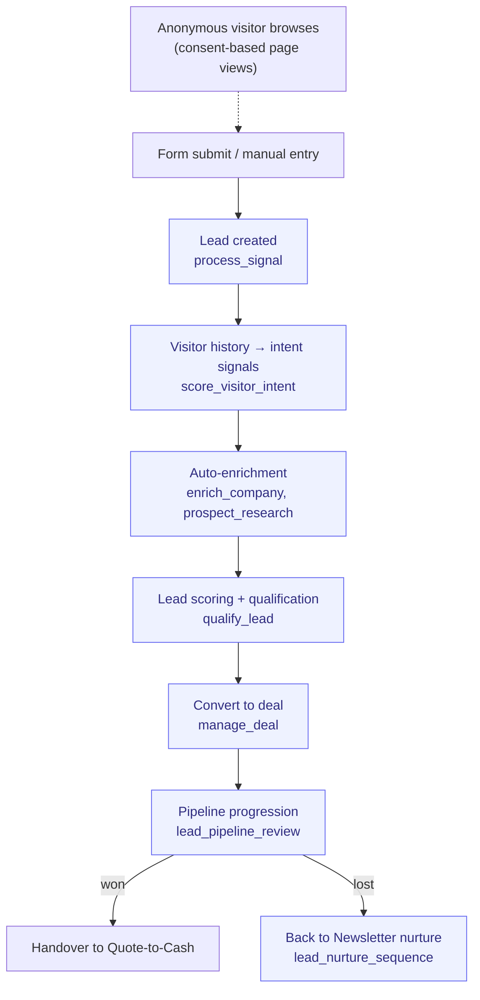

# Lead-to-Customer

> From first touch to closed-won. The full top-of-funnel + CRM pipeline.

**Problem it solves:** Inbound leads land in an inbox, get answered days later, and nobody remembers who was promised what — this process captures, enriches, scores and follows up every lead within minutes, automatically.

**Maturity level:** L4 — Agent-augmented
**Status:** ✅ Production-ready for SMB

---

## Modules involved

| Module | Role in the process |
|--------|---------------------|
| **Forms** | Captures inbound leads from web forms |
| **Visitor Intelligence** | Consent-based page-view tracking of anonymous visitors; when a visitor identifies (form/chat), their browsing history becomes scoring signals |
| **Leads** | Lead records, scoring, pipeline stages |
| **Companies** | B2B company registry with firmographic data |
| **Sales Intelligence** | Prospect research, enrichment, fit analysis |
| **Deals** | Sales pipeline with stages (qualified → won/lost) |
| **Newsletter** | Nurture sequences for leads not yet sales-ready |
| **Email** | Inbound Gmail sync resolves senders to existing leads/companies; outbound sends are logged to the communications gateway |

---

## Step-by-step flow

*🟦 = agent-runnable step (see Agent coverage below)*

---

## Agent coverage

| Step | 👤 Manual | 🤖 FlowPilot | 🔗 External agent |
|------|----------|-------------|-------------------|
| Form capture | ✅ | ✅ (`process_signal`) | — |
| Visitor intent scoring | — | ✅ (`score_visitor_intent` — auto: DB trigger on lead identify + 15-min cron; `get_visitor_timeline` for the per-lead journey) | — |
| Enrichment | ✅ | ✅ (`enrich_company`, `prospect_research`) | ✅ via MCP |
| Lead scoring | ✅ | ✅ (`qualify_lead`) | — |
| Pipeline review | ✅ | ✅ (`lead_pipeline_review`) | — |
| Nurture sequencing | ✅ | ✅ (`lead_nurture_sequence`) | — |
| Deal conversion | ✅ | ✅ (`manage_deal`) | — |
| Stale deal detection | — | ✅ (`deal_stale_check`) | — |
| Inbound email → lead/contact match | — | ✅ (`scan_gmail_inbox`, `ingest_inbound_email`; push via composio-webhook + `gmail_reconcile` poll cron; noise/bulk mail filtered by `classifyInbound`, sender resolved to `leads.email` or `company_contacts.contact_email`) | — |
| Outbound email audit trail | ✅ | ✅ (`send_email`, `list_communications`, `get_communication` — every send logged to `outbound_communications`) | — |

---

## Known gaps (missing for L5)

- ✅ Forecasting — `lead_pipeline_review` returns the weighted forecast (Σ deal value × stage probability, per-stage breakdown); Stage-3 verified
- ✅ Duplicate handling — `find_duplicate_leads` (email normalization incl. plus-addressing/case) + `merge_leads` (score-summing survivor); Stage-3 verified
- ✅ Lost reasons + win-rate — taxonomy (price/timing/competitor/no_response/other) + note on the lost transition; win/loss rollup in `lead_pipeline_review`
- ⚠️ Multi-touch attribution — `get_attribution_report` (paidGrowth) returns campaign/source/medium over a window across leads + orders; full multi-touch weighting still basic
- ❌ Round-robin lead assignment to reps
- ❌ Bulk email with unsubscribe-list management (Odoo mass-mail class; overlaps Newsletter)
- ❌ GDPR consent / preference center per contact (Odoo has consent tracking — relevant for every EU SMB)
- ⚠️ Lead scoring is activity+recency; Odoo's is predictive (deliberately kept simple for now)

---

## Webhook events

`form.submitted`, `lead.created`, `lead.score_updated`, `lead.status_changed`, `deal.won`, `deal.lost`

---

## Best for

SMBs with inbound + light outbound. Consultancies, B2B services, agencies.

## Not for

Enterprise with complex approval workflows, or pure outbound SDR organizations needing dialer/sequencer features.
