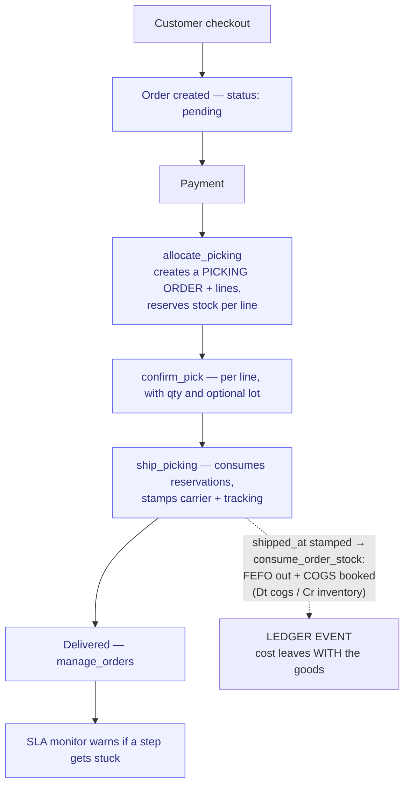

# Order-to-Delivery

> From customer order to delivered product. The core e-commerce flow.

**Problem it solves:** Orders arrive faster than the back office can track them — paid-but-never-picked slips through and stock counts drift — this process keeps every order's status honest from checkout to doorstep and warns when a step gets stuck.

**Maturity level:** L3 — Operational
**Status:** ✅ Happy path works; SLA monitor covers manual steps

---

## Modules involved

| Module | Role in the process |
|--------|---------------------|
| **Products** | Order records (`manage_orders`, `place_order`, `lookup_order`), catalog, pricing, cart recovery |
| **Inventory** | Stock reservation, picking (`allocate_picking`/`confirm_pick`/`ship_picking`), adjustments |
| **POS** | In-store sales channel that emits `stock.movement` events into the same fulfillment pipe |
| **SLA** | Monitors that manual steps happen on time |
| **Documents** | Delivery notes, shipping labels |
| **Newsletter** | Order confirmations, delivery notifications |

---

## Step-by-step flow

*🟦 = agent-runnable step (see Agent coverage below)*

**The cost follows the goods through the door (2026-08-25).** Measured on the
clean Nordbrygg ledger: order placement used to consume valuation layers and
book COGS in the order-insert transaction — 62 936 kr of cost stood booked for
goods still on the shelf, 29 500 of it for a CANCELLED order. As of
`20260828140000` the order commits (`products.stock_quantity`, availability
unchanged) and reserves; the first physical exit signal (`shipped_at` /
`delivered_at`) consumes FEFO and books COGS via the account roles
(`account_for('cogs')` / `account_for('inventory')`), and cancellation before
exit is a ledger non-event. The dry-run also caught that `20260827200000` had
redefined `process_stock_move_valuation` from a stale copy and DROPPED the COGS
block entirely — restored against the live body, pinned by
`kostnaden-foljer-varan-genom-dorren.guardrails.test.ts`.

**The picking is a document, not a status.** An earlier version of this diagram
drew picked/packed/shipped as states on the order. The platform actually has
`picking_orders` + `picking_lines` — separate records with their own number
(`PICK-YYYYMMDD-xxxxxx`), their own status, their own carrier and tracking — and
`stock_moves` / `stock_quants` / `stock_valuation_layers` underneath. That is
Odoo's shape (`stock.picking`, `stock.move`, `stock.quant`,
`stock.valuation.layer`), and reading the diagram as "just statuses" leads people
to build against the wrong object.

Note that `orders` ALSO carries `picked_at`, `packed_at`, `shipped_at` and
`tracking_number`, duplicating what the picking holds. They agree today because
one writer sets both; nothing structurally keeps them in step. Treat the picking
as authoritative.

---

## Agent coverage

| Step | 👤 Manual | 🤖 FlowPilot | 🔗 External agent |
|------|----------|-------------|-------------------|
| Order intake | — | ✅ Auto (Stripe webhook) | — |
| Stock check / reservation | ✅ | ✅ (`manage_inventory`, `reserve_stock`) | — |
| Cart recovery | — | ✅ (`cart_recovery_check`) | — |
| Pick/pack/ship | ✅ | ✅ (`allocate_picking`, `confirm_pick`, `ship_picking`) | ✅ over MCP |
| Partial fulfillment | ✅ (OrderLineFulfillment) | ✅ (`fulfill_order_line` — order ships when all lines complete) | — |
| Order status updates | ✅ | ✅ (`manage_orders`) | — |
| Customer notifications | ✅ | ✅ (Newsletter automation) | — |
| SLA escalation | — | ✅ (SLA module) | — |

---

## Known gaps (missing for L5)

- ✅ Returns / RMA — full reverse flow lives in [Return-to-Refund](./return-to-refund.md) (request → approve → receive → inspect → partial refund)
- ✅ Partial shipments — `order_items.qty_fulfilled` + `fulfill_order_line`; ships only when all lines complete
- ✅ Cycle counting — `manage_inventory_count` (skill + admin UI, Stage-3 verified 2026-07-06)
- ❌ Integrations with WMS / carriers (Postnord, DHL APIs) — the `shipping` module tracks shipments but has no carrier API adapters
- ❌ Multi-warehouse fulfillment routing
- ❌ Pre-orders / backorder auto-creation on stockout (partly via `back_in_stock_requests`)
- ❌ Picklists / pack-station UI (skills exist; warehouse-floor UI does not)

---

## Measured against Odoo (2026-08-22, live on the Nordbrygg testbed)

Odoo is the process reference — fifteen years of supporting these flows — so
divergence is measured against it rather than argued from first principles.

| Odoo concept | FlowWink |
|---|---|
| `stock.picking` / `stock.move` / `stock.quant` / `stock.valuation.layer` | ✅ `picking_orders` / `stock_moves` / `stock_quants` / `stock_valuation_layers` |
| Costing method set on the **product category** | ✅ `product_categories.costing_method` — same place |
| Costing: Standard Price / AVCO / FIFO | ⚠️ `fifo` \| `average` only — no Standard Price |
| Invoicing policy: ordered vs delivered qty, per product | ❌ **no such concept.** Odoo lets a business bill on confirmation or on actual delivery; we have neither setting nor branch |
| A `service` product has no stock moves, structurally | ⚠️ we have a `track_inventory` flag that every writer must remember to read — see below |
| Backorder picking created automatically on short delivery | ❌ listed above as a gap |
| Deleting a product with stock moves is refused | ❌ `stock_valuation_layers` CASCADEs on product delete — the valuation history, which is accounting evidence, dies with the product |

**Measured behaviour worth knowing:** stock leaves the ledger when the ORDER
LINE is created, before any picking exists and before payment, via an
auto-decrement trigger. `allocate_picking` then reserves again at payment time.
Two mechanisms act on the same balance at two different moments — in Odoo the
move belongs to the picking and there is only one such moment.

---

## Webhook events

`order.created`, `order.paid`, `order.fulfilled`, `stock.low`, `stock.adjusted`

---

## Best for

D2C / e-commerce with physical products, moderate volume (< 1000 orders/day), self-fulfillment or simple 3PL.

## Not for

Marketplaces with many sellers, or highly automated fulfillment centers (require WMS).
