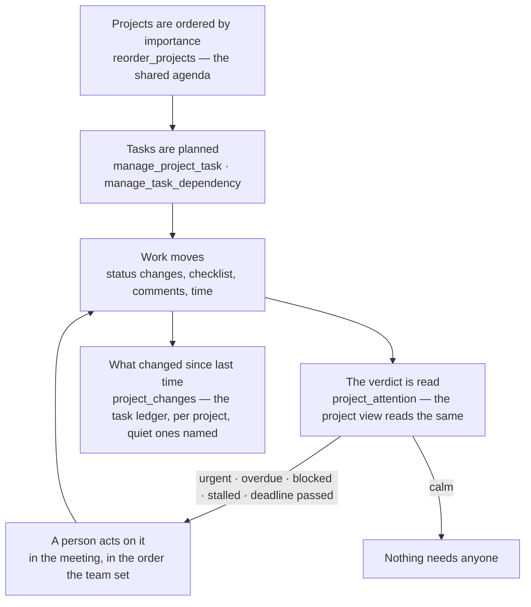

# Plan-to-Deliver

> From a list of projects to the question every status meeting starts with: *what needs someone now?*

**Problem it solves:** A team runs many workstreams at once — finance, legal, production, a listing — and the work that is really stuck is rarely the work that is late. It is waiting on something unfinished, it was marked urgent, or it has sat in progress with nobody touching it. A list sorted by creation date shows none of that.

**Maturity level:** L3 — Agent-readable
**Status:** ✅ Projects, tasks, dependencies and milestones; one verdict of what needs attention, shared by the project view and the agent's brief; a shared team order that is the meeting's agenda; what changed since the last meeting, read from a task ledger every writer feeds

---

## Modules involved

| Module | Role in the process |
|--------|---------------------|
| **Projects** | Projects, tasks, dependencies, milestones, the team order |
| **Timesheets** | Time entries count as movement on a task |
| **FlowPilot** | Reads the portfolio brief, writes steps and questions on tasks |

---

## Step-by-step flow

---

## What "needs attention" means

One rule, in the database (`project_attention_verdict`), read by both the project view and the agent's `project_portfolio_brief`:

| Signal | Means |
|---|---|
| **urgent** | an open task with priority *urgent* — the team has said it blocks |
| **overdue** | an open task past its due date, in the **platform's own day**, not the server's UTC day |
| **blocked** | an open task with an unfinished prerequisite |
| **stalled** | in progress with no *movement* for 5 days — a status change, a ticked checklist item, a person's comment or a time entry. An agent's own comment never counts, or the sensor would silence itself by asking |
| **deadline passed** | the project's own deadline is behind it and work is still open |

A task without a due date is never overdue — which is not the same as fine. A team that does not set dates shows its trouble as blocked, urgent or stalled instead, and the verdict sees it.

Projects that need attention are ordered by weight (urgent ×4, overdue ×3, blocked ×2, stalled ×1, deadline +3), and among equals by the team order.

## What a priority means

The scale is low / medium / high / urgent. What each level *means* is the team's — one sentence per level, kept in one place (`project_priority_guide`: platform defaults with the team's own words on top), shown under each option in the task's priority picker and carried by `project_attention` and `project_portfolio_brief`, so a person choosing and an agent choosing read the same text. Edit it where it is used ("What these mean" under the picker) or with `set_project_priority_guide`.

The verdict reads the level, not the words: **urgent** is what "needs attention" flags; **high** matters but does not block. Existing tasks keep their priority when the wording changes — apply a new scale task by task.

## The team order and the sort

Two different things:

- **The team order** is shared data — it is the agenda, everyone sees the same, and it is changed by dragging in the project view or by `reorder_projects`. A new project lands on top.
- **The sort** is the viewer's own: team order, needs attention first, recently active, name or newest. It is remembered per viewer and never written to the database, so one person's sort cannot flip the list for everyone.

*Recently active* uses the same definition of movement as *stalled*.

## What changed since last Tuesday

The second question a status meeting asks. It used to be answered by hand: a daily snapshot of every task in a flowtable, diffed at the meeting — because the platform remembered only the current state, and `updated_at` says *that* something changed, not *what*.

Now every change to a task is a row in the **task ledger** (`project_task_events`): created, status, priority, assignee, due date, title, milestone, checklist progress, deleted; a dependency added or removed; a milestone reached or reopened. A trigger writes it, so every writer obeys — the board, an agent, flowtable, an import. Nobody can edit or delete a row; a project's history goes only when the project itself does. A deleted task keeps its title in the ledger.

`project_changes(project, since, until)` reads it — the **Changes** tab in a project, the **Changes** entry over the whole portfolio, and the agent's skill of the same name:

| Section | Comes from |
|---|---|
| created · completed · reopened · moved · reprioritised · reassigned · rescheduled · renamed · progress · deleted · dependencies · milestones | the ledger |
| what people said, what agents did | `project_task_comments` (kind and author type kept) |
| hours logged, per person | `time_entries`, by the date the work was done |

Projects come in the team order — the agenda — and active projects with no change at all are named as **quiet**, so silence is an answer rather than a gap. "Since last Tuesday" is the viewer's choice (yesterday, last weekday, 7/14/30 days), remembered per browser.

**Where history begins:** the ledger starts when the instance receives it. Backwards it claims only what is certain — that a task was created (`created_at`) and completed (`completed_at`). A window that opens before that is marked `coverage: partial` per project: before `history_from`, an empty list means *not recorded*, not *nothing happened*. After it, what is not listed did not happen.

---

## Agent coverage

| Step | 👤 Manual | 🤖 FlowPilot | 🔗 External agent |
|------|----------|-------------|-------------------|
| Order projects | ✅ drag in the rail | ✅ (`reorder_projects`) | ✅ |
| Plan tasks and dependencies | ✅ | ✅ (`manage_project_task`, `manage_task_dependency`) | ✅ |
| Read what needs attention | ✅ "Needs attention" filter | ✅ (`project_attention`, `project_portfolio_brief`) | ✅ |
| Report progress | ✅ | ✅ (`comment_on_task`) | ✅ |
| Read what changed since the meeting | ✅ Changes tab / Changes entry | ✅ (`project_changes`) | ✅ |
| Set a priority, and say what it means | ✅ picker + "What these mean" | ✅ (`manage_project_task`, `project_priority_guide`, `set_project_priority_guide`) | ✅ |

---

## Known gaps

- ⚠️ Task history before the ledger was introduced is limited to creation and completion — the digest says so per project (`coverage: partial`)
- ❌ Workload per person across projects
- ⚠️ A prerequisite in a project the reader may not see does not count as blocking for that reader — the verdict reads with the caller's eyes, and does not reveal a private project's existence

## Best for

Teams running several workstreams at once, with a weekly status meeting.

## Not for

Resource-levelled scheduling with capacity per person — see `resource_capacity_report` for what exists.
