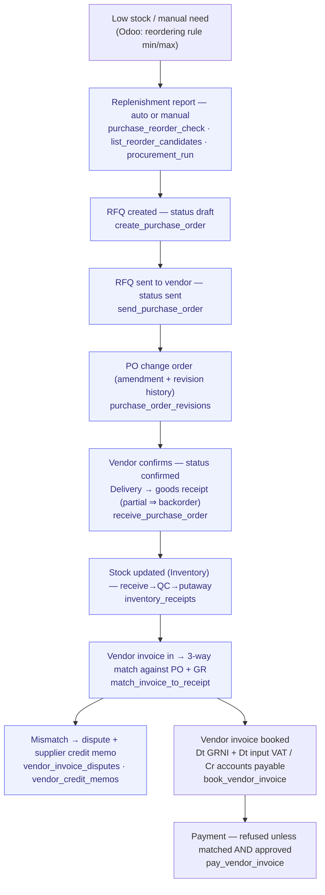

# Procure-to-Pay

> From need identification to paid vendor invoice.

**Problem it solves:** Receipts in a shoebox, vendor invoices matched by hand, and nobody knows what has actually been ordered — this process makes purchases and expenses flow to the ledger without manual bookkeeping.

**Maturity level:** L3 — Operational (3-way match auto-approve live)
**Status:** ✅ Happy path + auto-approve match works; lacks tiered approval thresholds

---

## Modules involved

| Module | Role in the process |
|--------|---------------------|
| **Purchasing** | Vendors, purchase orders, goods receipt |
| **Inventory** | Stock levels, reorder triggers |
| **Expenses** | Employee expense claims (side flow) |
| **Invoicing** | Incoming vendor invoices (AP) |
| **Accounting** | Booking against accounts payable + cost accounts |
| **Documents** | Storage of PO, delivery note, invoice PDF |

---

## Step-by-step flow



*🟦 = agent-runnable step (see Agent coverage below)*

---

## How it works in practice — Expenses (employee reimbursement)

*The adopter lens (see [README](./README.md) § The adopter layer). This is the
canonical home for the expense state machines — module docs link here and
never restate them.*

### The work story

An employee pays for something out of pocket and photographs the receipt in
FlowWink. AI reads it (`analyze_receipt`: amount, VAT, vendor, date, suggested
account) and the expense lands as a **draft** on the right month. At month end,
one action gathers all loose drafts into that month's **expense report**
(`generate_monthly_expense_report` — one report per employee and month, reused
if it exists). The employee submits; the manager approves; booking posts the
journal entry automatically; marking it paid records the actual payout. The
employee never touches a spreadsheet, the accountant never writes the voucher
by hand, and every step is visible as a status.

### State machines

Two coupled entities carry status. The **report** drives the process; each
**expense** follows its report.

**`expense_reports.status`** (one report per employee × month)

| Status | Meaning | Moved forward by | What the transition does |
|---|---|---|---|
| `draft` | Open collection bucket for the month | employee / agent | `generate_monthly_expense_report` attaches loose draft expenses in the period while the report is still draft |
| `submitted` | Sent for approval | employee / agent (`submit_expense_report`) | Locks all included expenses to `submitted` |
| `approved` | Manager signed off | admin / agent (`approve_expense_report`) | Marks all included expenses `approved` |
| `booked` | In the ledger | admin / agent (`book_expense_report`) | Posts the journal entry — **Dt cost account (net) + Dt 2641 input VAT / Cr 2890 owed-to-employee** — and stores `journal_entry_id` on the report |
| `paid` | Employee reimbursed | admin / agent (`mark_expense_report_paid`) | Posts **Dt 2890 / Cr 1930 (bank)** and creates an `expense_payments` row (amount, method, reference, who recorded it) |
| `rejected` | — | ⚠️ in schema, **transition not yet wired** (no function or UI path exists) | — |

**`expenses.status`** (individual receipts) — same value set; individual
expenses are moved by their report's transitions, never independently once
attached. `draft` expenses without a report are "loose" and get collected at
month end.

### Who does what

See the Agent coverage table below — the whole month-end loop
(generate → submit → approve → book → paid) is agent-runnable; approve/book/
paid require admin trust.

### Coming from spreadsheets

- The receipts shoebox/folder → receipt photo + AI extraction at purchase time
- The monthly Excel sheet → the auto-generated monthly report (nothing to build)
- The "OK?" column → the report status (`submitted` → `approved`), visible to both sides
- The accountant's hand-written voucher → `book_expense_report` posts it, balanced, with VAT split
- The "betald?"-note after the bank transfer → `mark_expense_report_paid` records method + reference and settles the liability account

---

## Agent coverage

| Step | 👤 Manual | 🤖 FlowPilot | 🔗 External agent |
|------|----------|-------------|-------------------|
| Vendor onboarding | ✅ | ✅ (`manage_vendor`) | — |
| Reorder detection | — | ✅ (`purchase_reorder_check`, `list_reorder_candidates`, `mrp_reorder_run`) | — |
| PO creation | ✅ | ✅ (`create_purchase_order`) | — |
| PO dispatch | ✅ | ✅ (`send_purchase_order`) | — |
| PO change order / revision history | ✅ | ✅ (`amend_purchase_order`, `list_po_revisions`) | — |
| Goods receipt | ✅ | ✅ (`receive_purchase_order`) | — |
| Receive→QC→putaway | ✅ | ✅ (`inventory_receipts`) | — |
| Expense handling | ✅ | ✅ (`manage_expenses`, `analyze_receipt`) | — |
| 3-way match | ⚠️ Manual fallback | ✅ (`match_invoice_to_receipt`, `auto_approve_vendor_invoice`) | 🔗 Delegation possible |
| Invoice dispute / supplier credit memo | ✅ | ✅ (`open_vendor_dispute`, `resolve_vendor_dispute`, `issue_vendor_credit_memo`, `apply_vendor_credit_memo`) | — |
| Vendor scorecard (on-time / price / quality) | ✅ | ✅ (`vendor_scorecard`, `rate_vendor`) | — |
| Expense P2P loop | ✅ | ✅ (`submit_/approve_/book_/mark_expense_report_paid`) | — |

---


## Known gaps

> ✅ **Amendments, disputes and vendor credits got their doors — 2026-09-19.**
> The three rows above named TABLES as if they were skills: an agent could not
> amend a line on a sent order, open a dispute or take a credit memo. And behind
> the admin panel "Apply" on a credit memo only set `status = 'applied'` — nothing
> was booked, and `pay_vendor_invoice` still paid the bill in full. Now: the
> amendment and its revision are one transaction under the order's lock (received
> quantity is the floor; growth past the approved amount opens a new approval);
> a bill under open dispute cannot be paid; a credit memo is booked (payables,
> the bill's VAT share, cost or price variance) and the table refuses `applied`
> without a journal entry; the payment is the total minus applied credits; and the
> three-way match counts credits — so "register a vendor credit memo", the remedy
> the payment gate always advised for an over-invoiced bill, actually clears it.

> ⚠️ **The reordering rule had FOUR homes — the 2026-08-22 note below was premature.**
>
> Measured end-to-end on the Nordbrygg testbed 2026-08-23: `procurement_run`
> answered **0** new suggestions while `list_reorder_candidates` answered **22**,
> worth **306 963,75 kr** of duplicate orders. They read the same rules but not the
> same availability — one counted incoming POs and reserved stock, the other read
> `products.stock_quantity` alone. A fourth, `purchase_reorder_check`, had
> reimplemented the whole calculation in TypeScript. They also resolved the vendor
> from different columns, silently.
>
> Settled for real 2026-08-23: the arithmetic left all four for
> `stock_virtual_available()` and `reorder_preferred_vendor()`. The verbs stayed.
> Proof: with all incoming marked received both engines flag the same 22 products,
> `qty_mismatch = 0`, `vendor_mismatch = 0`.
>
> The lesson is about the note, not the code: *reading the same rules is not the
> same as computing the same answer.* The earlier fix aligned the inputs and
> called it settled without measuring the outputs.
>
> ✅ **The reordering rule had three homes — 2026-08-22 (#247).**
> `reorder_rules` is canonical: the Odoo min/max rule the UI writes and
> `procurement_run` reads. `list_reorder_candidates`, `purchase_reorder_check`
> and `mrp_reorder_run` now read the same rules with the same interpretation,
> falling back to `products.low_stock_threshold` only for products with no rule.
> A product with no rule and no threshold has no reorder point and is not
> suggested — the hardcoded 5 is gone. See
> [README](./README.md#resolved-the-reordering-rule-has-one-home).

### Other gaps (missing for L5)

- ✅ **3-way match is a LOCK, not a label** — corrected 2026-08-23. It used to compare
  each bill against the PO's whole received value without subtracting what earlier
  bills had already claimed, so the same delivery invoiced twice read as
  `matched, 0 % variance` and auto-approved: **30 105,60 kr against a 13 440,00 kr
  delivery**. And `pay_vendor_invoice` paid a bill flagged `over_invoiced` with
  `approved_at = NULL`, skipping `approved` entirely. Now: the claim is derived
  per PO net of sibling bills, the match is recomputed at payment time, and the
  gate sits on the status transition — `received → paid` is impossible. Overruling
  it goes through the house approvals chain and is recorded.
- ✅ **Multi-currency vendor invoices** — the order carries the vendor's currency and
  a stamped rate, and the valuation converts once, at receipt. A missing rate
  **refuses the order** rather than booking it at 1. Before: a EUR machine entered
  stock at 1 696 kr instead of 19 334 and reported a 94,8 % margin against a real 41,2 %.
- ❌ Multi-step approval based on amount thresholds
- ❌ Vendor portal (vendor self-service login)
- ❌ EDI integration for large suppliers
- ❌ **Backorder as its own document** — a short delivery is only
  `quantity − received_quantity`. Nothing carries "9 units, week 38"; Odoo creates a
  second picking.
- ❌ **Bill Control Policy per product** (Odoo: invoice on ordered vs received
  quantities). The instance-wide default lives in `site_settings.purchasing`.
- ❌ **RFQ → confirmed as two states.** `rfqs`/`rfq_lines`/`rfq_bids` exist as tables
  with no skills; `sent` is not `confirmed` and there is no verb for the vendor's
  acknowledgement.
- ❌ **Landed costs in the chain.** `allocate_landed_cost` exists but sits outside it,
  so freight and duty from an overseas vendor never reach the goods cost.

---

## Measured against Odoo (2026-08-23, live on the Nordbrygg testbed)

Odoo is the process reference — fifteen years of supporting these flows — so
divergence is measured against it rather than argued from first principles. The
chain was run end to end with real money, then run again after each fix.

**The conclusion the measurement kept returning:** the difference is not the
steps. We have nearly all of them. It is that **Odoo's steps are locked to each
other** — bill control policy → three-way match → "Should Be Paid" → payment —
while ours were parallel labels nothing read. Every single function answered
correctly on its own. It broke when the next step asked the previous one what it
had produced.

| Odoo concept | FlowWink |
|---|---|
| `supplierinfo` price with quantity tiers and vendor currency | ✅ `vendor_products` + `pick_vendor_price` — one ordering rule, tier included |
| Receipt posts to **Stock Interim (Received)**, the bill clears it | ✅ `goods_received_not_invoiced` role, closed by `book_vendor_invoice` |
| `qty_invoiced` per order line | ⚠️ derived per PO, net of sibling bills — value, not per-line quantity. `vendor_invoices` has no line table; storing an allocation of a header amount would mean inventing one and then trusting the invention |
| **"Should Be Paid"** blocks payment until the match is clean | ✅ on the status transition, with the house approvals chain as the only override |
| Order in the vendor's currency, rate on the order | ✅ stamped by the database, so all six PO writers are covered |
| Virtual stock = on hand − reserved + incoming | ✅ `stock_virtual_available()`, one calculation, four readers |
| Lot selection forced on the outgoing move | ⚠️ FEFO automatically — the deduction happens in a trigger where no human can choose; requiring one would stop checkout |
| **Backorder** as its own document | ❌ |
| **Bill Control Policy** per product | ❌ instance-wide only |
| **RFQ → confirmed** as two states | ❌ tables exist, no skills |
| **Landed costs** inside the chain | ❌ |

### The seam that matters most

Goods receipt is where **cost enters the system** — `stock_valuation_layers.unit_cost_cents`,
per the product category's costing method — and that exact figure is booked as COGS
when the goods leave. A wrong price on the way in is a wrong gross margin on the
way out, and **it is invisible in either process alone**. Measure them together:
receive at a known price, sell, and check that the cost booked is the cost paid.

Verified after the fixes, 60 kg of coffee at a tier price of 175,00 kr/kg:

```
receipt   Dt 1460 Inventory      10 500,00   Cr 2441 GRNI            10 500,00
invoice   Dt 2441 GRNI           10 500,00   Cr 2440 Accounts payable 11 760,00
          Dt 2641 Input VAT       1 260,00
payment   Dt 2440 Accounts payable 11 760,00 Cr 1930 Bank            11 760,00

net: inventory +10 500 · input VAT +1 260 · bank −11 760 · GRNI 0 · payable 0
```

Before the fixes the middle entry did not exist: GRNI stood at −60 736 kr and
growing, the payable had become an asset, and **8 044,80 kr of deductible VAT was
absent from the VAT return**. Every entry balanced on its own, so nothing raised
an alarm — which is why the platform's own `inventory_gl_reconciliation` never
saw it either. That sensor measures inventory against valuation layers and cannot
see a clearing account; `grni_reconciliation()` was added for what it could not
look at.

---

## Webhook events

`purchase_order.created`, `purchase_order.received`, `stock.low`, `stock.adjusted`, `expense.submitted`, `expense.status_changed`

---

## Best for

SMBs with physical inventory or recurring purchasing. Consultancies for expense handling.

## Not for

Manufacturing with complex BOM/MRP, or groups with multi-entity intercompany flows.
