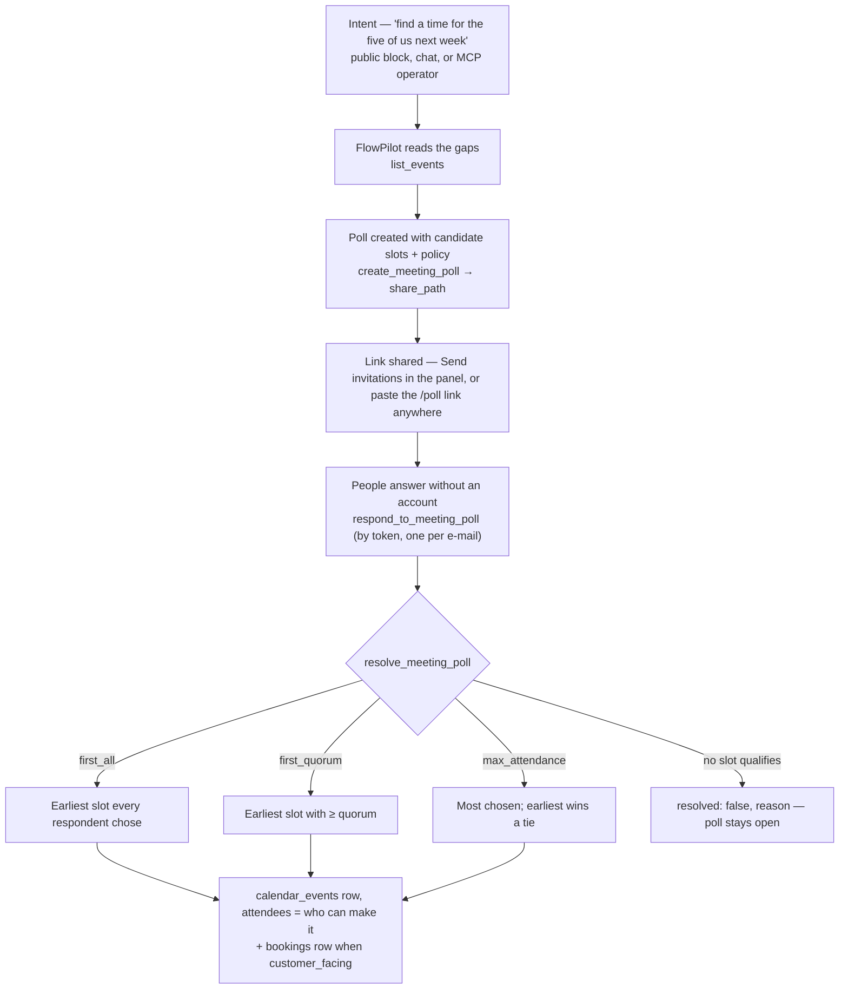

# Propose-to-Meet

> From "when can we all meet?" to a calendar event with the right attendees:
> propose, share, answer, resolve — with the decision made by a rule, not by a
> button.

**Problem it solves:** Group scheduling lives in message threads — five people,
three proposals, nobody sure who said yes to what. Booking handles one customer
against one grid; it cannot hold a *set* of times open for a *group*. Odoo
Appointments cannot either, which is why Doodle sits beside it. This process
makes the proposal a first-class object, lets outsiders answer without an
account, and makes "first time that works for everyone" deterministic.

**Maturity level:** L3 — Proven (the battery scenario ran green from a fresh
install 2026-09-30: 47 assertions, every rule, the wall, idempotent resolve)
**Status:** ✅ Step 1 (data model, four RPCs, four skills, battery scenario) and
step 2 (public page + block, admin panel, comms) shipped — see #590. The UI is
not battery-covered: the battery drives skills, and the panel calls the same
RPCs.

Modelled on [timeslot.fit](https://github.com/magnusfroste/timeslot), ported as a
model rather than as code: that app has no rule (the organizer taps *confirm*),
identifies people by name, and leaves its row-level security open.

---

## Modules involved

| Module | Role in the process |
|--------|---------------------|
| **Meeting Polls** | The poll, its slots, the answers, the rule (`meeting_polls`, `meeting_poll_slots`, `meeting_poll_responses`) |
| **Calendar** | Where a resolved poll lands: a `calendar_events` row with the respondents as attendees; `list_events` is where FlowPilot reads the gaps to propose from |
| **Booking** | Module gate for staff access; a `customer_facing` poll also creates a `bookings` row on resolve |
| **Email** | The share link out (`comms-send` kind `meeting_poll_invite`), the decision back to everyone who can make it (`meeting_poll_confirmation`) |
| **FlowPilot** | Proposes slots from the calendar's gaps; the block only captures intent (Law 3) |

---

## Step-by-step flow

---

## How it works in practice

**The two audiences never share a door.** Staff reach the tables through the
booking module gate. Everyone else reaches *nothing* directly: the base tables
carry no policy for `anon`, and every public access goes through
`get_meeting_poll_by_token` / `respond_to_meeting_poll_by_token` — the same
idiom as `get_quote_by_token`. The public view shows slots with counts and
respondents as initials; e-mail addresses never leave the database.

**"First" is about time.** `first_all` picks the earliest `starts_at` that every
respondent chose — not the organizer's list order. A tie under `max_attendance`
goes to the earliest slot. Both are `ORDER BY … LIMIT 1` in SQL, so two calls on
the same answers give the same result.

**No qualifying slot is an answer, not an error.** `resolve_meeting_poll` returns
`resolved: false` with a reason (*"no slot works for everyone (3 responded)"*)
and leaves the poll open. Callers read `resolved`, never `success`.

**Resolving twice creates nothing.** The second call returns the existing
result; the battery asserts exactly one `calendar_events` row per poll.

**Two faces of one poll.** The `/poll/:token` page and the `meeting-poll` block
render the same component; the admin panel under Bookings → Meeting polls is
where the organizer creates, sends, watches the answers (with addresses — staff
only) and presses the rule. Deciding also mails the confirmation to the people
who chose the slot.

---

## Agent coverage

| Step | Skill | Surface |
|------|-------|---------|
| Propose | `create_meeting_poll` | internal (FlowPilot, MCP) |
| Answer | `respond_to_meeting_poll` | **external** — by share token, `trust_level: notify` |
| Decide | `resolve_meeting_poll` | internal |
| Oversee | `list_meeting_polls` | internal |

Verified by `scripts/process-battery/scenarios/propose-to-meet.ts`: the wall
(anon may call the two token RPCs and nothing else), the pick (exactly the slot
all three chose), the attendees (exactly those three), idempotent resolve, the
tie rule, and the honest *nothing*.
