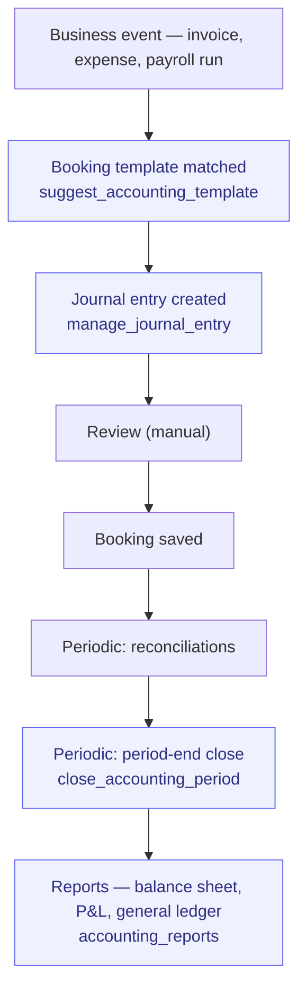

# Record-to-Report

> From transaction to financial report. Bookkeeping + period-end close.

**Problem it solves:** The books live with an external accountant and the owner learns the numbers months later — this process keeps double-entry bookkeeping, reconciliation and reports in-house and current, with balanced vouchers posted automatically.

**Maturity level:** L3 — Operational (period lock + reconciliation live)
**Status:** ✅ Double-entry bookkeeping, period lock, bank file/image OCR import; ⚠️ no tax filings

---

## Modules involved

| Module | Role in the process |
|--------|---------------------|
| **Accounting** | Chart of accounts (BAS 2024 / IFRS / US GAAP via locale packs), journal entries, templates, period lock, export adapters (SIE 4 / SAF-T) |
| **Reconciliation** | Stripe payouts sync, bank file/image (OCR) import, auto-matching |
| **Invoicing** | Source for AR bookings; credit notes mirror their invoice (`credit_note_issued`) |
| **POS** | One entry per closed session (`pos_session`): tenders by method, revenue and VAT per rate, tips, cash difference — sales tendered on invoice are the invoice's |
| **Returns** | A refund reverses revenue and VAT against the booked sale — the order's `order_paid` entry or its invoice (`return_refund`); goods restocked book COGS back (`inventory_return`) |
| **E-commerce** | An order is booked when it becomes `paid` (`order_paid`): clearing account in debit, revenue and VAT per rate in credit |
| **Expenses** | Source for AP / expense bookings (auto-booked on approval) |
| **Analytics** | Financial KPI reports |
| **Documents** | Voucher / supporting document archive |

---

## Step-by-step flow



*🟦 = agent-runnable step (see Agent coverage below)*

---

## Agent coverage

| Step | 👤 Manual | 🤖 FlowPilot | 🔗 External agent |
|------|----------|-------------|-------------------|
| Chart of accounts setup | ✅ | ✅ (`manage_chart_of_accounts`) | — |
| Template management | ✅ | ✅ (`manage_accounting_template`) | — |
| Booking suggestion | — | ✅ (`suggest_accounting_template`) | — |
| Journal entries | ✅ | ✅ (`manage_journal_entry`) | — |
| Opening balances | ✅ | ✅ (`manage_opening_balances`) | — |
| Reconciliations | ✅ | ⚠️ Partial (autonomous) — now incl. partial-match variance, petty-cash, sign-off | — |
| Reports | ✅ | ✅ (`accounting_reports`) | — |
| Period-end close | ✅ | ✅ (`close_accounting_period`, `reopen_accounting_period`) | — |
| Tax reporting | ❌ Missing | — | — |

---

## Known gaps (missing for L4+)

- ✅ **Period-end close workflow** — `close_accounting_period` locks JE + JE-lines + time_entries via guard triggers
- ❌ Tax reporting (VAT, employer reports, K10) — see § The Swedish statutory tail below for the full map + borrow plan
- ❌ **Correction flow for posted vouchers (storno)** — today a mistake is fixed by reopening the period and editing, which breaks the immutability principle Swedish law expects (BFL: posted vouchers are never edited — you post a reversal or a correction entry). Needed: `reverse_journal_entry` / `correct_journal_entry` skills + UI, and with them the period-reopen path becomes the exception instead of the correction mechanism
- ✅ SIE export — pluggable adapters per locale pack (SE → SIE 4, generic → SAF-T + CSV)
- ✅ Bank feed / reconciliation — `import_bank_file`, `import_bank_image` (OCR), `sync_stripe_payouts`, `auto_match_transactions`; ❌ live PSD2 bank connection (Odoo and Accounted both have feed-level sync; a `bank_feed_connections` scaffold exists but aggregator sync needs Plaid/Tink creds)
- ✅ Reconciliation depth (2026-07-08) — partial-match with variance write-off, petty-cash reconciliation, and reconciliation sign-off (`reconciliation_signoffs`, locks matched lines once balanced)
- ✅ Agentic bookkeeping matcher — `suggest_accounting_template` / `propose_bookkeeping` rewritten with a word-boundary + Swedish-compound scorer (no more substring false-matches) and bank-leg-derived net base; template data cleaned (goods→3001, VAT-payment 1:1 via 2650, bank-paid equipment template)
- ❌ Cash-flow statement (kassaflödesanalys) — we report balance sheet + P&L + GL; the third statement is missing
- ❌ Document retention enforcement — the archive stores vouchers' documents, but nothing enforces the 7-year rule or provides the BFL-required *systemdokumentation* and *arkivplan* artifacts
- ✅ Reverse-charge VAT (omvänd skattskyldighet) on expenses — `expenses.reverse_charge_rate` is a declared field (never inferred from currency/vendor); booking pairs the outgoing/ingoing VAT legs so box 30 and box 48 report correctly instead of netting to a silent zero
- ✅ **E-commerce orders are booked when paid** (`order_paid`, 2026-09-17): the status flip to `paid` — from the Stripe webhook, an operator or the demo cycle, no live integration needed — posts Dt payment-provider clearing (role `payment_clearing`, BAS 1580) / Cr revenue and output VAT per rate, shipping included, discount spread; `sync_stripe_payouts` then settles the clearing account against the bank. An invoice raised for a paid order is a receipt and is not booked again; a refund reverses against the order and credits the clearing account when the money goes back through the provider
- ❌ Manufacturing labor is capitalised in the finished good's valuation layer but not posted to the ledger
- ❌ Multi-currency revaluation
- ⚠️ Cost center / project-level — `manage_analytic_account` + `tag_journal_entry_analytics` exist; reporting limited
- ❌ Consolidation (multi-entity)
- ✅ Cron health monitoring — `cron_health_report()` (surfaced via `instance-health` check=cron) flags stalled/failing scheduled jobs, including the reconciliation and knowledge-indexer crons that feed this process — an admin/agent finds out before month-end that a sync silently stopped, instead of during close

---

## The Swedish statutory tail — the calendar the SE locale pack must serve

*Added 2026-07-06 after reviewing [erp-mafia/accounted](https://github.com/erp-mafia/accounted)
(open-source Swedish bookkeeping, BAS 2026, AGPL) — the reference for what
"complete" looks like for a Swedish SMB. The SE plugin work borrows from it;
this section maps the rhythm so the process doc tells the whole truth. The
ranked gap list (P0–P2, incl. live findings on the dev instance) lives in
[docs/parity/references/accounting-accounted.md](../parity/references/accounting-accounted.md)
— this section is the calendar, that card is the build order.*

A Swedish SMB's accounting year is a fixed sequence of statutory events on top
of the operational loop above. Status per step:

| Rhythm | Obligation | FlowWink today | Borrow/learn from Accounted |
|---|---|---|---|
| Continuous | Löpande bokföring, sequential vouchers, gap explanations (BFNAR 2013:2) | ✅ `assign_voucher_number` + `list_voucher_gaps`/`explain_voucher_gap` | Their draft→commit split with atomic voucher RPC matches ours; parity |
| Continuous | Voucher immutability — storno, never edit | ❌ (gap above) | `reverseEntry()`/`correctEntry()` pattern (storno-service) |
| Monthly/quarterly | **Momsdeklaration** — SKV 4700 ruta mapping, per-rate breakdown, EU/export handling | ⚠️ ruta mapping (`se-vat-boxes.ts`) and reverse-charge (box 30/48) booking now correct on real data; no filing/submission | Their VAT engine maps accounts → rutor declaratively; the ruta map is spec knowledge, not code — borrow freely |
| Monthly (with employees) | **AGI** employer declaration | ❌ (payroll runs exist; no filing) | Their salary-journal report feeds it |
| Quarterly (EU B2B sales) | **Periodisk sammanställning** (EU sales list) | ❌ | They export it as CSV per SKV format |
| Yearly | **Bokslut** (K2/K3), year-end dispositions | ⚠️ `year_end_readiness` + `propose_accruals`/`propose_annual_depreciation` + `run_year_end` cover the mechanics; no K2/K3 statement pack | Their `dev_docs/bokslut` carries worked K2 examples + Bolagsverket's XBRL taxonomy for årsredovisning |
| Yearly (AB) | **Årsredovisning** to Bolagsverket (XBRL), **INK2 + SRU** to Skatteverket | ❌ | INK2/SRU encoders exist as libs (`lib/reports/ink2`, `sru-encoding`) |
| Yearly (EF) | **NE-bilaga** | ❌ | Ditto (`lib/reports/ne-bilaga`) |
| Always | 7-year archive, systemdokumentation + arkivplan (BFL 7 kap) | ❌ enforcement | They enforce retention on delete, hash documents (SHA-256), and ship template docs for both artifacts |
| Always | Deadline awareness (moms/AGI/INK2 dates) | ❌ | A deadlines status engine — pairs naturally with FlowPilot's briefing ("moms due in 5 days, here's the draft") |

**Positioning consequence:** "operational finance, filings via your accountant"
remains true today — but each ❌ above is a concrete SE-plugin milestone, and
the deadline engine + VAT draft is the highest-leverage first slice: it turns
FlowPilot into the assistant that *prepares* filings even while a human still
submits them.

**License note for the borrow mandate:** Accounted is AGPL-3.0. Specs,
ruta-mappings, report layouts and process knowledge are free to learn from;
copying code verbatim into FlowWink pulls AGPL obligations — keep borrowed
material at the pattern/spec level (or in a separately-licensed plugin) unless
a deliberate licensing decision is made.

---

## Period close & lock

When `close_accounting_period(year, month)` is called (skill `close_accounting_period`, or via `lock_timesheet_period`):

| Table | Guard trigger | Effect |
|-------|---------------|--------|
| `journal_entries` | `guard_journal_entries_period` | Insert/update/delete blocked for entry_date in closed period |
| `journal_entry_lines` | `guard_journal_entry_lines_period` | Same, propagated through parent entry |
| `time_entries` | `guard_time_entries_period` ✨ | Insert/update/delete blocked — protects payroll & invoicing cutoffs |

Reopen via `reopen_accounting_period(year, month)` (admin only). Periods in `locked` state cannot be reopened.

---

## Webhook events

`invoice.created`, `invoice.paid`, `expense.status_changed`

---

## Best for

Smaller companies that want internal visibility into their finances, complementing an external accountant for filings.

## Not for

Companies looking to fully replace Fortnox/Visma — we are not a complete accounting system yet. Position us as "operational finance" rather than "filings".

---

## Neutral-core safety primitives (locale-agnostic)

Three universal primitives sit above the per-pack bookkeeping logic and apply equally to SE/IFRS/DE/UK/US:

### 1. Staged-Operation Envelope

Every high-risk ledger-mutating skill (`manage_journal_entry`, `book_expense_report`, `mark_expense_report_paid`, `record_pos_sale_v2`, `close_pos_session_v2`, `close_accounting_period`, `reopen_accounting_period`) is flagged `requires_staging=true`. MCP callers receive a **preview envelope** with `risk_level`, `period_status`, and the payload that *would* be written, plus a pointer to `approve_pending_operation` / `reject_pending_operation`. Nothing reaches the ledger until an operator (human or peer) approves.

Flow:
```
peer → manage_journal_entry(args)
  ← 202 { staged:true, pending_id, preview, next:{approve,reject} }
operator → approve_pending_operation(pending_id)
peer → manage_journal_entry(args, _approved_operation_id=pending_id)
  ← 200 { entry_id, voucher_number, ... }
```

See `mem://accounting/staged-operations-envelope`.

### 2. Voucher integrity

`assign_voucher_number` trigger guarantees sequential `(series, year)` numbering on every `journal_entries` insert. `list_voucher_gaps` + `explain_voucher_gap` (both MCP skills) let auditors and FlowPilot detect and explain any break — universal requirement across BAS, HGB/SKR, IFRS, US GAAP.

### 3. Year-end orchestration

`year_end_readiness(year)` runs a 6-point checklist before any close. `propose_accruals(year)` and `propose_annual_depreciation(year)` produce stagable proposals. `run_year_end(year, confirm)` is the orchestrator. Country-specific extras (SE periodiseringsfond, DE Rückstellungen, US deferred tax) plug in via `pack.year_end_proposals?(year)` — core stays neutral.

See `mem://accounting/year-end-readiness`.
