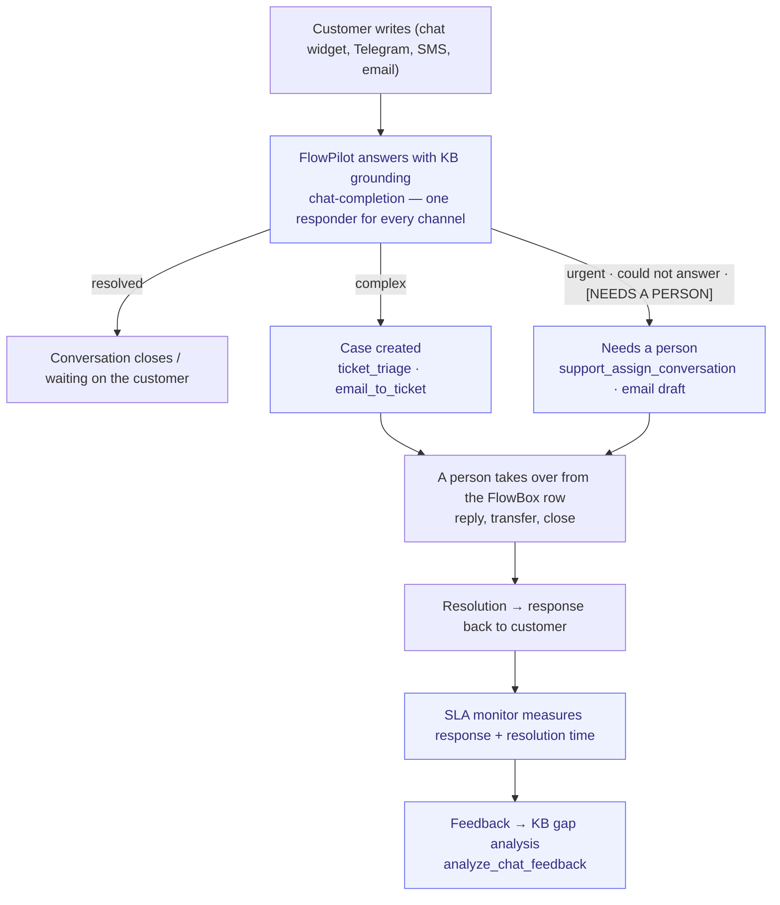

# Support-to-Resolution

> From customer question to resolved case. Self-service + human handoff.

**Problem it solves:** The same questions arrive over and over, answers depend on who happens to reply, and urgent cases drown in the inbox — this process answers instantly from the knowledge base and escalates only what truly needs a human.

**Maturity level:** L4 — Agent-augmented
**Status:** ✅ AI Chat + KB + ticketing work; every channel lands in one queue (FlowBox) organised by who has it; inbound email is answered by FlowPilot first (draft or send per mailbox) and becomes a case per the mailbox's route mode with noise filtering; SLA state is visible per ticket (badge + "SLA breached" filter); customers follow their own cases in the portal (`/account/support`)

---

## Modules involved

| Module | Role in the process |
|--------|---------------------|
| **AI Chat** | Frontline — FlowPilot answers visitors directly (widget, Telegram, SMS) |
| **Email** | The company mailbox — FlowPilot answers first under the mailbox's reply mode; tickets open per its route mode |
| **Knowledge Base** | Source for agent answers, self-service portal |
| **Tickets** | Structured cases for complex issues |
| **FlowBox** (Contact Center module) | One queue over chat, email, tickets, forms and calls — the hand-off list; human takeover of chats, replies inline |
| **SLA** | Monitors response/resolution times, escalates on delay |

---

## Step-by-step flow

*🟦 = agent-runnable step (see Agent coverage below)*

---

## Agent coverage

| Step | 👤 Manual | 🤖 FlowPilot | 🔗 External agent |
|------|----------|-------------|-------------------|
| Frontline answers (chat, Telegram, SMS) | — | ✅ (chat-completion) | — |
| First reply on inbound email | ✅ (FlowBox / Email → Inbox) | ✅ (`draft_email_reply` — draft or send per mailbox `reply_mode`) | ✅ |
| KB lookup | ✅ | ✅ (KB embedded in context) | — |
| Ticket triage | ✅ | ✅ (`ticket_triage`) | — |
| Email → case | — | ✅ (`email_to_ticket`, per mailbox `route_mode`) | ✅ |
| Conversation assignment | ✅ (Transfer to… on the FlowBox row) | ✅ (`support_assign_conversation`) | ✅ |
| Human response | ✅ (inline on the FlowBox row: email, chat, ticket, form) | — | — |
| SLA escalation | — | ✅ (SLA monitor automation) | — |
| Feedback analysis | — | ✅ (`analyze_chat_feedback`, `support_get_feedback`) | — |
| KB gap → new article | ✅ | ✅ (`kb_gap_analysis` + `manage_kb_article`) | — |

---

## Known gaps (missing for L5)

- ✅ Email channel — `email_to_ticket` turns inbound email into cases (verified E2E: email → SLA policy → `sla_check` → triage → assign). Inbound is classified first (`classifyInbound` in `supabase/functions/_shared/email/ingest-gmail.ts`): newsletters/bulk are kept as communications and never become tickets, and `crm_only` mailboxes are gated out of ticket creation. FlowPilot answers first (`draft_email_reply`): a draft on the thread by default, sent when the mailbox is `ai_first` and the answer is grounded — see [email-guide](../modules/email-guide.md)
- ✅ One queue — FlowBox lists chat, email, tickets, forms and calls together, grouped by who has it (**Needs a person** / **With FlowPilot** / **Waiting on the customer** / **Done**), with FlowPilot's steps per row. WhatsApp and Slack are not channels
- ✅ SLA visibility on the case — `useTicketSla` + `TicketSlaBadge` show breached / due-soon countdowns in the ticket list and drawer; `/admin/tickets` has an "SLA breached" filter chip and SLA Monitor violations deep-link to the affected ticket (`?ticket=<id>`)
- ✅ Customer self-service portal — `/account/support` (`src/pages/account/MyTicketsPage.tsx`) lists the customer's own **and** their company's cases with the public thread and a reply box, guarded by the `can_view_ticket()` RLS helper (internal notes stay hidden)
- ✅ Bulk case handling — checkbox selection in `TicketsTable` with bulk status / assignee / team updates
- ✅ Ownership model — separate **requester** (customer) and **assignee/owner** (staff, incl. "Assign to me"), plus `created_by`; an external agent can set both via `manage_ticket`
- ✅ Conversation transfer — live conversations can be handed between agents (**Transfer to…** on the chat row in FlowBox, `current_conversations` load surfaced via `list_support_agents`)
- ⚠️ CSAT — chat feedback capture + `analyze_chat_feedback`/`support_get_feedback` exist; a per-case post-resolution survey (Odoo-style rating email) is not wired, though the `surveys` module could carry it
- ✅ Macros / canned responses for human agents — `manage_canned_response`
- ✅ Queue / team assignment + routing — `route_conversation` (least-loaded agent handling the queue) + `manage_ticket` reassign; escalation rules via `manage_sla_escalation`
- ✅ Time tracking per ticket — `ticket_time_entries` with start/stop timer, manual entries and a billable subtotal in the ticket drawer (also loggable via `log_time` in timesheets)
- ✅ Escalation rules — `ticket_escalation_rules` + `run_ticket_escalations()` (age/status/priority/unassigned conditions → raise priority, reassign, notify), with a rule builder and "Run sweep now" on the Escalation tab of `/admin/tickets`
- ⚠️ Skill-based routing to specific agents — partial: `route_conversation` routes to the least-loaded agent that handles the queue (not per-named-skill yet)
- ✅ Internal knowledge base — the Wiki module (internal, non-public) is separate from the public KB; the retrieval engine indexes both (`knowledge_chunks` + `search_knowledge`)
- ❌ Ticket split/merge — a case cannot yet be split into sub-cases or merged into a duplicate
- ❌ Rule-based automation beyond escalation (Odoo-style automated actions on field change)

---

## Webhook events

(None dedicated yet — could be extended with `ticket.created`, `ticket.resolved`)

## Odoo comparison

Benchmarked against Odoo **Helpdesk**: ~90% parity — see
[`../parity/capabilities/tickets.json`](../parity/capabilities/tickets.json).
Remaining scored gaps are ticket split/merge and rule-based automation triggers.

---

## Best for

SMBs with inbound support questions where 60–80% can be resolved via self-service / AI. Consultancies, early-stage SaaS.

## Not for

High-volume call centers, or B2B enterprises with dedicated Customer Success Managers per account.
